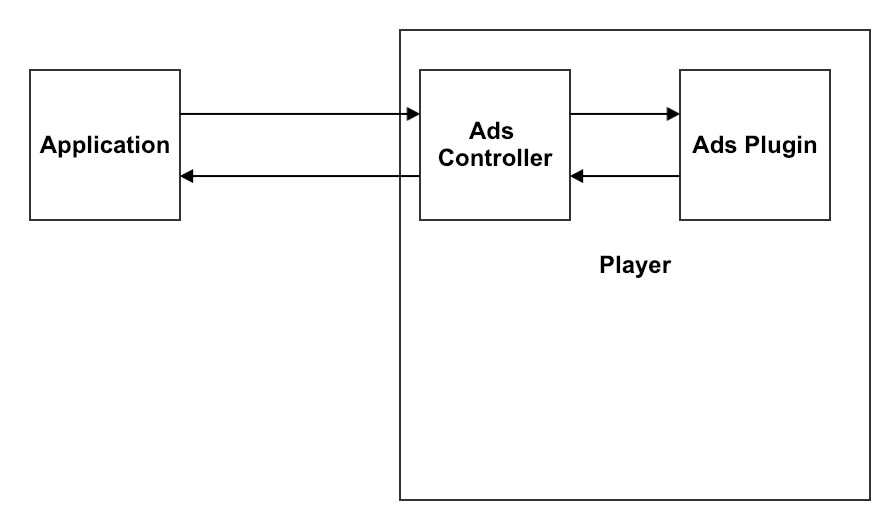
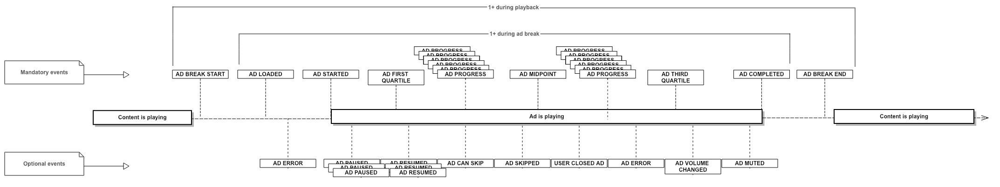
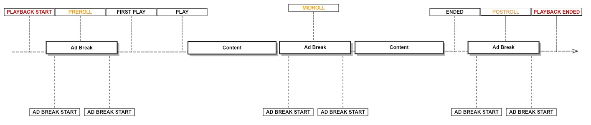

# Ads

The Kaltura TV Platform Player supports the addition of 3rd party monetization solutions via its plugin system. To allow easy integration and to support playback and analytics using any 3rd party solution, the player defines an advertizing framework using APIs and a standard event scheme.

Any plugin that adds support for ads is expected to follow the controller, timeline, and events scheme.
This document details the ads controller, which allows controlling ad-related operations, the ad timeline (which explains how a typical order of events looks like), and the ad events and their associated payload.

## Ads Controller

To query the player regarding the ad's state in the current playback, you can use the ads controller by referencing `player.ads`.
The ads controller is responsible for tracking and communicating with the active ads plugin, as well as for collecting and saving the current ads state and data.


> A complete reference to the AdsController can be found [here](#AdsController).

#### Examples:

##### Know when a scheduled ad break will play

```js
const layout = player.ads.getAdBreaksLayout();
console.log(layout); // [0, 15, -1]
```

##### Check if all ads are completed

```js
if (player.ads.allAdsCompleted) {
  // do something
}
```

##### Check if this is the middle of an ad break

```js
if (player.ads.isAdBreak()) {
  // do something
}
```

##### Get the current ad break data

```js
if (player.ads.isAdBreak()) {
  const adBreak = player.ads.getAdBreak();
  // do something
}
```

##### Get the current ad data

```js
if (player.ads.isAdBreak()) {
  const ad = player.ads.getAd();
  // do something
}
```

## Ad Events Timeline

During ad playback, there are events that get triggered to indicate the current ad state or state changes.
Some events are life cycle indicators and will always get triggered, while others are reactive to specific actions -- such as the user clicking the ad -- and may or may not be triggered.

In the following diagram you can observe the events timeline from the point that an ad break starts to the point that the ad break ends.



If you want to know when playback has started/ended -- whether the playback includes ads or not -- use the following events:

- `PLAYBACK_START` - Triggered on the first play request for playback. If a pre-roll ad is about to play, this event will be triggered before the pre-roll. If no pre-roll ad is about to play, this event will be triggered before any other content event including `FIRST_PLAY`.

- `PLAYBACK_ENDED` - Triggered when playback is ended. If a post-roll ad is about to play, this event will be triggered after post-roll. If no post-roll ad is about to play, this event will be triggered after any other content event including `ENDED`.

You can observe the following timeline diagram that simulates these events' exact location:


## Ad Events

| Events List                                 |
| ------------------------------------------- |
| [`AD_CAN_SKIP`](#AD_CAN_SKIP)               |
| [`AD_MANIFEST_LOADED`](#AD_MANIFEST_LOADED) |
| [`AD_LOADED`](#AD_LOADED)                   |
| [`AD_STARTED`](#AD_STARTED)                 |
| [`AD_RESUMED`](#AD_RESUMED)                 |
| [`AD_PAUSED`](#AD_PAUSED)                   |
| [`AD_CLICKED`](#AD_CLICKED)                 |
| [`AD_SKIPPED`](#AD_SKIPPED)                 |
| [`AD_COMPLETED`](#AD_COMPLETED)             |
| [`AD_ERROR`](#AD_ERROR)                     |
| [`ALL_ADS_COMPLETED`](#ALL_ADS_COMPLETED)   |
| [`AD_BREAK_START`](#AD_BREAK_START)         |
| [`AD_BREAK_END`](#AD_BREAK_END)             |
| [`AD_FIRST_QUARTILE`](#AD_FIRST_QUARTILE)   |
| [`AD_MIDPOINT`](#AD_MIDPOINT)               |
| [`AD_THIRD_QUARTILE`](#AD_THIRD_QUARTILE)   |
| [`USER_CLOSED_AD`](#USER_CLOSED_AD)         |
| [`AD_VOLUME_CHANGED`](#AD_VOLUME_CHANGED)   |
| [`AD_MUTED`](#AD_MUTED)                     |
| [`AD_PROGRESS`](#AD_PROGRESS)               |

#

> ### <a name="AD_CAN_SKIP"></a>AD_CAN_SKIP
>
> Fires when an ad's skippable state has changed and the ad can be skipped.

#

> ### <a name="AD_MANIFEST_LOADED"></a>AD_MANIFEST_LOADED
>
> Fires when the ad manifest has been loaded and the ad layout is available.
> <br><br>_payload parameters:_
>
> | Name               | Type            | Description                                                         |
> | ------------------ | --------------- | ------------------------------------------------------------------- |
> | `adBreaksPosition` | `Array<number>` | An array that represents the ad break's time on the media timeline. |

#

> ### <a name="AD_LOADED"></a>AD_LOADED
>
> Fires when an ad has been loaded and ad data is available.
> <br><br>_payload parameters:_
>
> | Name | Type        | Description |
> | ---- | ----------- | ----------- |
> | `ad` | [`Ad`](#Ad) | The ad data |

#

> ### <a name="AD_STARTED"></a>AD_STARTED
>
> Fires when an ad has been started and ad data is available.
> <br><br>_payload parameters:_
>
> | Name | Type        | Description |
> | ---- | ----------- | ----------- |
> | `ad` | [`Ad`](#Ad) | The ad data |

#

> ### <a name="AD_RESUMED"></a>AD_RESUMED
>
> Fires when the ad resumed after a pause.

#

> ### <a name="AD_PAUSED"></a>AD_PAUSED
>
> Fires when the ad paused.

#

> ### <a name="AD_CLICKED"></a>AD_CLICKED
>
> Fires when the ad has been clicked by the user.

#

> ### <a name="AD_SKIPPED"></a>AD_SKIPPED
>
> Fires when the ad has been skipped.

#

> ### <a name="AD_COMPLETED"></a>AD_COMPLETED
>
> Fires when the ad completes playing.

#

> ### <a name="AD_ERROR"></a>AD_ERROR
>
> Fires when an error occurred while the ad was loading or playing.\
> <br><br>_payload parameters:_
>
> | Name       | Type     | Description                                                                 |
> | ---------- | -------- | --------------------------------------------------------------------------- |
> | `severity` | `string` | The error severity                                                          |
> | `category` | `string` | The error category                                                          |
> | `code`     | `number` | The error code                                                              |
> | `data`     | `Object` | The error data: the original ad error can be accessed by `data.innerError`. |

#

> ### <a name="ALL_ADS_COMPLETED"></a>ALL_ADS_COMPLETED
>
> Fires when the player is done playing all the ads.

#

> ### <a name="AD_BREAK_START"></a>AD_BREAK_START
>
> Fires before an ad break is about to start.
> <br><br>_payload parameters:_
>
> | Name      | Type                  | Description       |
> | --------- | --------------------- | ----------------- |
> | `adBreaK` | [`AdBreak`](#AdBreak) | The ad break data |

#

> ### <a name="AD_BREAK_END"></a>AD_BREAK_END
>
> Fires when an ad break is finished.

#

> ### <a name="AD_FIRST_QUARTILE"></a>AD_FIRST_QUARTILE
>
> Fires when the ad playhead crosses first the quartile.

#

> ### <a name="AD_MIDPOINT"></a>AD_MIDPOINT
>
> Fires when the ad playhead crosses the midpoint.

#

> ### <a name="AD_THIRD_QUARTILE"></a>AD_THIRD_QUARTILE
>
> Fires when the ad playhead crosses the third quartile.

#

> ### <a name="USER_CLOSED_AD"></a>USER_CLOSED_AD
>
> Fires when the ad is closed by the user.

#

> ### <a name="AD_VOLUME_CHANGED"></a>AD_VOLUME_CHANGED
>
> Fires when the ad volume has changed.

#

> ### <a name="AD_MUTED"></a>AD_MUTED
>
> Fires when the ad volume has been muted.

#

> ### <a name="AD_PROGRESS"></a>AD_PROGRESS
>
> Fires on ad time progress.
> <br><br>_payload parameters:_
>
> | Name         | Type               | Description          |
> | ------------ | ------------------ | -------------------- |
> | `adProgress` | `AdProgressObject` | The ad progress data |
>
> ###### Type `AdProgressObject`
>
> ```js
> {
>   currentTime: number,
>   duration: number
> }
> ```

## Ads API Reference

- [AdBreak][1]
  - [Parameters][2]
  - [type][3]
  - [position][4]
  - [numAds][5]
- [Ad][6]
  - [Parameters][7]
  - [id][8]
  - [contentType][9]
  - [url][10]
  - [title][11]
  - [position][12]
  - [duration][13]
  - [clickThroughUrl][14]
  - [posterUrl][15]
  - [skipOffset][16]
  - [linear][17]
  - [width][18]
  - [height][19]
  - [bitrate][20]
  - [skippable][21]
- [AdsController][22]
  - [Parameters][23]
  - [allAdsCompleted][24]
  - [isAdBreak][25]
  - [getAdBreaksLayout][26]
  - [getAdBreak][27]
  - [getAd][28]
  - [skipAd][29]
  - [playAdNow][30]
    - [Parameters][31]

## <a name="AdBreak"></a>AdBreak

### Parameters

- `options` **PKAdBreakOptions** - The ad break data options.

### type

Returns **[string][32]** - The ad break type - pre/mid/post.

### position

Returns **[string][32]** - The ad break position on the playback timeline.

### numAds

Returns **[string][32]** - The number of ads inside the ad break.

## <a name="Ad"></a>Ad

### Parameters

- `id` **[string][32]** Ad ID.
- `options` **PKAdOptions** - The ad data options.

### id

Returns **[string][32]** - The ad ID.

### contentType

Returns **[string][32]** - The ad content type.

### url

Returns **[string][32]** - The ad URL.

### title

Returns **[string][32]** - The ad title.

### position

Returns **[string][32]** - The ad position inside the ad break.

### duration

Returns **[string][32]** - The ad duration.

### clickThroughUrl

Returns **[string][32]** - The ad click-through URL.

### posterUrl

Returns **[string][32]** - The ad poster URL.

### skipOffset

Returns **[string][32]** - The ad skip offset.

### linear

Returns **[string][32]** - Whether the ad is linear.

### width

Returns **[string][32]** - The ad width.

### height

Returns **[string][32]** - The ad height.

### bitrate

Returns **[string][32]** - The ad bitrate.

### skippable

Returns **[string][32]** - Whether the ad is skippable or not.

## <a name="AdsController"></a>AdsController

### Parameters

- `player` **Player** The player.
- `adsPluginController` **IAdsController** - The controller of the current ads plugin instance.

### allAdsCompleted

Returns **[boolean][33]** - Whether all ads are completed.

### isAdBreak

Returns **[boolean][33]** - Whether we're in an ad break.

### getAdBreaksLayout

Returns **[Array][34]&lt;[number][35]>** - The ad break's layout (cue points).

### getAdBreak

Returns **[AdBreak][36]?** - Gets the current ad break data.

### getAd

Returns **[Ad][37]?** - Gets the current ad data.

### skipAd

Skips an ad.

Returns **void**

### playAdNow

Play an ad on demand.

#### Parameters

- `adTagUrl` **[string][32]** - The ad tag url to play.

Returns **void**

[1]: #adbreak
[2]: #parameters
[3]: #type
[4]: #position
[5]: #numads
[6]: #ad
[7]: #parameters-1
[8]: #id
[9]: #contenttype
[10]: #url
[11]: #title
[12]: #position-1
[13]: #duration
[14]: #clickthroughurl
[15]: #posterurl
[16]: #skipoffset
[17]: #linear
[18]: #width
[19]: #height
[20]: #bitrate
[21]: #skippable
[22]: #adscontroller
[23]: #parameters-2
[24]: #alladscompleted
[25]: #isadbreak
[26]: #getadbreakslayout
[27]: #getadbreak
[28]: #getad
[29]: #skipad
[30]: #playadnow
[31]: #parameters-3
[32]: https://developer.mozilla.org/docs/Web/JavaScript/Reference/Global_Objects/String
[33]: https://developer.mozilla.org/docs/Web/JavaScript/Reference/Global_Objects/Boolean
[34]: https://developer.mozilla.org/docs/Web/JavaScript/Reference/Global_Objects/Array
[35]: https://developer.mozilla.org/docs/Web/JavaScript/Reference/Global_Objects/Number
[36]: #adbreak
[37]: #ad
