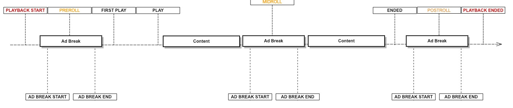

# Ads

## Ads Events

| Events List                                 |
| ------------------------------------------- |
| [`AD_CAN_SKIP`](#AD_CAN_SKIP)               |
| [`AD_MANIFEST_LOADED`](#AD_MANIFEST_LOADED) |
| [`AD_LOADED`](#AD_LOADED)                   |
| [`AD_STARTED`](#AD_STARTED)                 |
| [`AD_RESUMED`](#AD_RESUMED)                 |
| [`AD_PAUSED`](#AD_PAUSED)                   |
| [`AD_CLICKED`](#AD_CLICKED)                 |
| [`AD_SKIPPED`](#AD_SKIPPED)                 |
| [`AD_COMPLETED`](#AD_COMPLETED)             |
| [`AD_ERROR`](#AD_ERROR)                     |
| [`ALL_ADS_COMPLETED`](#ALL_ADS_COMPLETED)   |
| [`AD_BREAK_START`](#AD_BREAK_START)         |
| [`AD_BREAK_END`](#AD_BREAK_END)             |
| [`AD_FIRST_QUARTILE`](#AD_FIRST_QUARTILE)   |
| [`AD_MIDPOINT`](#AD_MIDPOINT)               |
| [`AD_THIRD_QUARTILE`](#AD_THIRD_QUARTILE)   |
| [`USER_CLOSED_AD`](#USER_CLOSED_AD)         |
| [`AD_VOLUME_CHANGED`](#AD_VOLUME_CHANGED)   |
| [`AD_MUTED`](#AD_MUTED)                     |
| [`AD_PROGRESS`](#AD_PROGRESS)               |

#

> ### <a name="AD_MANIFEST_LOADED"></a>AD_MANIFEST_LOADED
>
> Fires when the ad manifest has been loaded and the ad layout is available.
> <br><br>_payload parameters:_
>
> | Name               | Type            | Description                                                      |
> | ------------------ | --------------- | ---------------------------------------------------------------- |
> | `adBreaksPosition` | `Array<number>` | Array which represents the ad breaks time on the media timeline. |

#

> ### <a name="AD_LOADED"></a>AD_LOADED
>
> Fires when an ad has been loaded and ad data is available.
> <br><br>_payload parameters:_
>
> | Name | Type | Description  |
> | ---- | ---- | ------------ |
> | `ad` | [`Ad`](#Ad) | The ad data. |

#

> ### <a name="AD_STARTED"></a>AD_STARTED
>
> Fires when an ad has been start and ad data is available.
> <br><br>_payload parameters:_
>
> | Name | Type | Description  |
> | ---- | ---- | ------------ |
> | `ad` | `Ad` | The ad data. |

#

> ### <a name="AD_RESUMED"></a>AD_RESUMED
>
> Fires when the ad resumed after pause.

#

> ### <a name="AD_PAUSED"></a>AD_PAUSED
>
> Fires when the ad paused.

#

> ### <a name="AD_CLICKED"></a>AD_CLICKED
>
> Fires when the ad has been clicked by the user.

#

> ### <a name="AD_SKIPPED"></a>AD_SKIPPED
>
> Fires when the ad has been skipped.

#

> ### <a name="AD_COMPLETED"></a>AD_COMPLETED
>
> Fires when the ad completes playing.

#

> ### <a name="AD_ERROR"></a>AD_ERROR
>
> Fires when an error occurred while ad was loading or playing.\
> <br><br>_payload parameters:_
>
> | Name       | Type     | Description                                                                 |
> | ---------- | -------- | --------------------------------------------------------------------------- |
> | `severity` | `string` | The error severity.                                                         |
> | `category` | `string` | The error category.                                                         |
> | `code`     | `number` | The error code.                                                             |
> | `data`     | `Object` | The error data. The original ad error can be accessed by `data.innerError`. |

#

> ### <a name="ALL_ADS_COMPLETED"></a>ALL_ADS_COMPLETED
>
> Fires when the player is done playing all the ads.

#

> ### <a name="AD_BREAK_START"></a>AD_BREAK_START
>
> Fires before an ad break is about to start.
> <br><br>_payload parameters:_
>
> | Name      | Type      | Description        |
> | --------- | --------- | ------------------ |
> | `adBreaK` | `AdBreak` | The ad break data. |

#

> ### <a name="AD_BREAK_END"></a>AD_BREAK_END
>
> Fires when an ad break is finished.

#

> ### <a name="AD_FIRST_QUARTILE"></a>AD_FIRST_QUARTILE
>
> Fires when the ad playhead crosses first quartile.

#

> ### <a name="AD_MIDPOINT"></a>AD_MIDPOINT
>
> Fires when the ad playhead crosses midpoint.

#

> ### <a name="AD_THIRD_QUARTILE"></a>AD_THIRD_QUARTILE
>
> Fires when the ad playhead crosses third quartile.

#

> ### <a name="USER_CLOSED_AD"></a>USER_CLOSED_AD
>
> Fires when the ad is closed by the user.

#

> ### <a name="AD_VOLUME_CHANGED"></a>AD_VOLUME_CHANGED
>
> Fires when the ad volume has changed.

#

> ### <a name="AD_MUTED"></a>AD_MUTED
>
> Fires when the ad volume has been muted.

#

> ### <a name="AD_PROGRESS"></a>AD_PROGRESS
>
> Fires on ad time progress.
> <br><br>_payload parameters:_
>
> | Name         | Type               | Description           |
> | ------------ | ------------------ | --------------------- |
> | `adProgress` | `AdProgressObject` | The ad progress data. |
>
> ###### Type `AdProgressObject`
>
> ```js
> {
>   currentTime: number,
>   duration: number
> }
> ```

## Ads Events Timeline

While ads are playing, the above events will be triggered in a certain order. In addition, some of them may not be triggered at all, and some of them will be triggered in each time. In the following diagram you can observe the events timeline from the point that ad break start to the point that ad break ends.


If you want to be aware when playback is started/ended whether its including ads or not, you can use the following events:

- `PLAYBACK_START` - Triggered on the first play request for playback. If preroll ad will play, this event will be triggered before the preroll. If no preroll is about to play, this event will be triggered before any other content event including `FIRST_PLAY`.

- `PLAYBACK_ENDED` - Triggered when playback is ended. If postroll ad will play, this event will be triggered after postroll. If no postroll is about to play, this event will be triggered after any other content event including `ENDED`.

You can observe the following timeline diagram that simulate those events exact location:


## Ads Controller

To query the player regarding ads state in the current playback, you can use the ads controller by referencing `player.ads`.
The ads controller is in charge to track and communicate with the active ads plugin and collect and save the current ads state and data.


> Pay attention:

#### Examples:

##### Know when a scheduled ad break will play

```js
const layout = player.ads.getAdBreaksLayout();
console.log(layout); // [0, 15, -1]
```

##### Check if all ads are completed

```js
if (player.ads.allAdsCompleted) {
  // do something
}
```

##### Check if we're in the middle of an ad break

```js
if (player.ads.isAdBreak()) {
  // do something
}
```

##### Get the current ad break data

```js
if (player.ads.isAdBreak()) {
  const adBreak = player.ads.getAdBreak();
  // do something
}
```

##### Get the current ad data

```js
if (player.ads.isAdBreak()) {
  const ad = player.ads.getAd();
  // do something
}
```

## Ads API Reference

- [AdBreak][1]
  - [Parameters][2]
  - [type][3]
  - [position][4]
  - [numAds][5]
- [Ad][6]
  - [Parameters][7]
  - [id][8]
  - [contentType][9]
  - [url][10]
  - [title][11]
  - [position][12]
  - [duration][13]
  - [clickThroughUrl][14]
  - [posterUrl][15]
  - [skipOffset][16]
  - [linear][17]
  - [width][18]
  - [height][19]
  - [bitrate][20]
  - [skippable][21]
- [AdsController][22]
  - [Parameters][23]
  - [allAdsCompleted][24]
  - [isAdBreak][25]
  - [getAdBreaksLayout][26]
  - [getAdBreak][27]
  - [getAd][28]
  - [skipAd][29]
  - [playAdNow][30]
    - [Parameters][31]

## AdBreak

### Parameters

- `options` **PKAdBreakOptions** Ad break data options.

### type

Returns **[string][32]** Ad break type - pre/mid/post.

### position

Returns **[string][32]** Ad break position on the playback timeline.

### numAds

Returns **[string][32]** The number of ads inside the ad break.

## <a name="Ad"></a>AD_VOLUME_CHANGED

### Parameters

- `id` **[string][32]** Ad ID.
- `options` **PKAdOptions** Ad data options.

### id

Returns **[string][32]** Ad ID.

### contentType

Returns **[string][32]** Ad ID.

### url

Returns **[string][32]** Ad URL.

### title

Returns **[string][32]** Ad title.

### position

Returns **[string][32]** Ad position inside the ad break.

### duration

Returns **[string][32]** Ad duration.

### clickThroughUrl

Returns **[string][32]** Ad click through URL.

### posterUrl

Returns **[string][32]** Ad poster URL.

### skipOffset

Returns **[string][32]** Ad skip offset.

### linear

Returns **[string][32]** Whether the ad is linear.

### width

Returns **[string][32]** Ad width.

### height

Returns **[string][32]** Ad height.

### bitrate

Returns **[string][32]** Ad bitrate.

### skippable

Returns **[string][32]** Whether the ad is skippable or not.

## AdsController

### Parameters

- `player` **Player** The player.
- `adsPluginController` **IAdsController** The controller of the current ads plugin instance.

### allAdsCompleted

Returns **[boolean][33]** Whether all ads completed.

### isAdBreak

Returns **[boolean][33]** Whether we're in an ad break.

### getAdBreaksLayout

Returns **[Array][34]&lt;[number][35]>** The ad breaks layout (cue points).

### getAdBreak

Returns **[AdBreak][36]?** Gets the current ad break data.

### getAd

Returns **[Ad][37]?** Gets the current ad data.

### skipAd

Skip on an ad.

Returns **void**

### playAdNow

Play an ad on demand.

#### Parameters

- `adTagUrl` **[string][32]** The ad tag url to play.

Returns **void**

[1]: #adbreak
[2]: #parameters
[3]: #type
[4]: #position
[5]: #numads
[6]: #ad
[7]: #parameters-1
[8]: #id
[9]: #contenttype
[10]: #url
[11]: #title
[12]: #position-1
[13]: #duration
[14]: #clickthroughurl
[15]: #posterurl
[16]: #skipoffset
[17]: #linear
[18]: #width
[19]: #height
[20]: #bitrate
[21]: #skippable
[22]: #adscontroller
[23]: #parameters-2
[24]: #alladscompleted
[25]: #isadbreak
[26]: #getadbreakslayout
[27]: #getadbreak
[28]: #getad
[29]: #skipad
[30]: #playadnow
[31]: #parameters-3
[32]: https://developer.mozilla.org/docs/Web/JavaScript/Reference/Global_Objects/String
[33]: https://developer.mozilla.org/docs/Web/JavaScript/Reference/Global_Objects/Boolean
[34]: https://developer.mozilla.org/docs/Web/JavaScript/Reference/Global_Objects/Array
[35]: https://developer.mozilla.org/docs/Web/JavaScript/Reference/Global_Objects/Number
[36]: #adbreak
[37]: #ad
