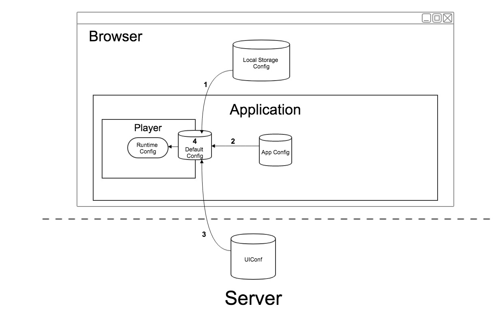

## Configuration
Configuration parameters could be provided upon instantiation of the player instance.
```js
var config = {
  // Configuration here
};
var player = KalturaPlayer.setup(config);
```

#### Configuration Structure
```js
{
  targetId: string,
  logLevel: string,
  disableUserCache: boolean,
  player: PKPlayerOptionsObject,
  provider: ProviderOptionsObject,
  ui: UIOptionsObject
}
```
##
>### config.targetId
>##### Type: `string`
>##### Default: `-`
>##### Description: Defines the id of the DOM element which the player will be added to.
##
>### config.logLevel
>##### Type: `string`
>##### Default: `"ERROR"`
>##### Description: Defines the player log level.
>Possible values: `"DEBUG", "INFO", "TIME", "WARN", "ERROR", "OFF"`
## 
>### config.disableUserCache
>##### Type: `boolean`
>##### Default: `false`
>##### Description: Indicates whether to stop using saved user preferences.
>User preferences are actions that triggered by the user and produced a configurable value which saved in the browser's local storage. The player uses those values to enable consistent use of the player. For example, if the last watched media was muted, the next media will be muted also, even if the user refreshed the page.
<br>More on user preferences in the player can be found [here]().
## 
>### config.player
>##### Type: `PKPlayerOptionsObject`
>##### Description: Defines the player configuration.
>Full configuration documentation for this part can be found [here](). 
##
>### config.provider
>##### Type: `ProviderOptionsObject`
>##### Description: Defines the provider configuration.
>Full configuration documentation for this part can be found [here](). 
##
>### config.ui
>##### Type: `UIOptionsObject`
>##### Description: Defines the ui configuration.
>Full configuration documentation for this part can be found [here](). 

## Configuration Strength
In the player setup flow, a configuration as described above (partially or full) can be supplied from couple of different sources:
* **Application** - The application which embeds the player can configures the player inline upon instantiation.
* **Server** - A partner configuration that is saved on server. The partner can use this configuration when configures the player by suppling the `uiConfId` value.
* **Local Storage (Browser)** - The user preferences configuration that are saved in the local storage of the browser. 
* **Default Player Configuration** - A default player configuration is internally defined by the player. 

When the player builds his runtime configuration, he should know how to built it correctly according to the strength of each configuration.
<br>The strength order is:
**<br>*Local Storage **>** Application **>** Server **>** Default Player Configuration***

#### Example
Let's assume the following configurations from each source:

Local Storage
```js
{
	muted: true,
	audioLanguage: 'spa'
}
```
Application
```js
{
	muted: false,
	volume: 0.7
}
```
Server
```js
{
	audioLanguage: 'eng'
	autoplay: true
}
```
Default Player Configuration
```js
{
	audioLanguage: '',
	textLanguage: '',
	muted: false,
	volume: 1,
	autoplay: false
}
```

**The result runtime configuration will be:**

```js
{
	audioLanguage: 'spa',
	textLanguage: '',
	muted: true,
	volume: 0.7,
	autoplay: true
}
```
