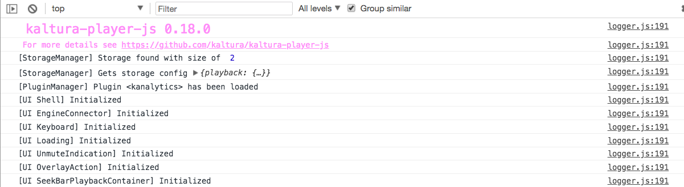

# Debugging & Troubleshooting

In this section you'll learn how to use debug mode to view explicit messages in the player to troubleshoot detected problems.

## Table of Contents
  * [Running the Player in Debug Mode](#running-the-player-in-debug-mode)
  * [About Player Logs](#about-player-logs)
  * [Log Conventions](#log-conventions)
  * [Controlling the Log Level](#controlling-the-log-level)
    
## Running the Player in Debug Mode

To debug the player and view explicit messages in the console, you'll need to run the player in debug mode using one of the following options:

**Option 1: Define a global window debug variable**

In your application, define at the top of your page the following window debug variable:
```js
window.DEBUG_KALTURA_PLAYER = true;
```
**Option 2: Add a query string parameter to the page URL**

In your page URL, add the `debugKalturaPlayer` query string parameter:
```js
http://my/page/url?debugKalturaPlayer
```
**Options 3: Using Player Config**
```js
var config = {
    ...
    logLevel: "DEBUG"
    ...
};
var player = KalturaPlayer.setup(config);
```

## About Player Logs  

After implementing one of the options above, open your browser developer tools and look at the player logs, for example:



### Log Conventions  

As you can see from the figure above, the player log conventions are built with the following template:
```bash
[Component] Message
```
>Note: Remember to stick to these conventions when building you application to ensure that debugging & troubleshooting are easy to understand.

### Controlling the Log Level 

If you want to use different log level than `DEBUG`, you'll need to configure the player with the desired log level. For example, to display only logs from a warning level and above in the console, use the following:

```js
var config = {
    ...
    logLevel: "WARN"
    ...
};
```
<br>For a complete list of log levels, click ~~here~~.


