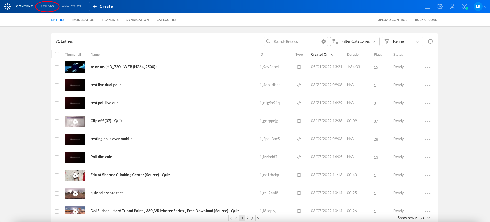
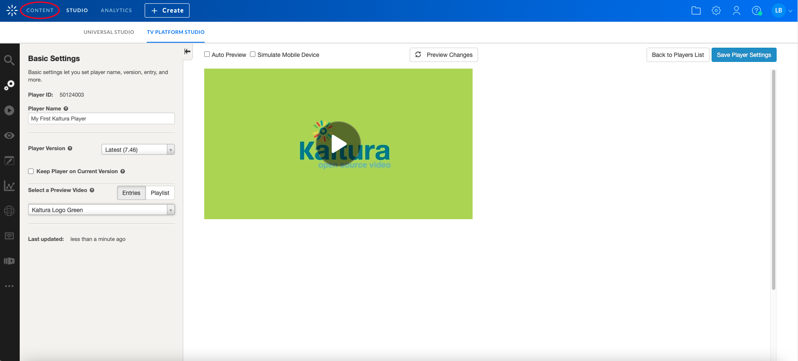

# Getting Started

To getting started with Kaltura Player you should have an active Kaltura Management Console (KMC) account. For more Information see [here](https://corp.kaltura.com/Products/Video-Applications/Kaltura-Video-Management-Console).

## Create Your Own Kaltura Player 

Go to [KMC](https://kmc.kaltura.com/index.php/kmc/kmc4#studio%7Cuniversal_studio) and select the *Studio* tab.


Once you are in the *Studio* go to the *TV Platform Studio*.
 

Here you can see your created player list or to add a new one.<br>
Lets create a new player by clicking *Add New Player*.
 

Here you can custom the player you just create, but for now the default player is enough.<br>
Lets call the new player *"My first Kaltura Player"* and click *Save Player Settings*.


Congratulations!!<br> 
You have a Kaltura Player.

## Create Kaltura Player Embed Code

Go to the *Content* tab.
 

Here you can manage your loaded entries, playlists and etc.<br>
Browse the entry you desire to embed, open the *Select Action* dropdown and select *Preview & Embed*.
 

Here you can choose the player you want to use in the embed code, And the embed type - Auto, Dynamic or Iframe. For more details see [Embed Types](./embedTypes.md).<br>
For now:
 - Select *My first Kaltura Player* you just created from the player list.
 - Click *Show Advanced Options* and select *Dynamic Embed* option.
 - Click *Copy* to copy the embed code to clipboard. 
 

## Embed the Kaltura Player into Your Website

Lets create a simple html file:
```html
<!DOCTYPE html>
<html>
<head>
  <meta charset="utf-8">
  <meta http-equiv="Content-Type" content="text/html; charset=utf-8"/>
<head>
<body>
</body>
</html>
```
Add a Div element for the player:  
```html
<!DOCTYPE html>
<html>
<head>
  <meta charset="utf-8">
  <meta http-equiv="Content-Type" content="text/html; charset=utf-8"/>
<head>
<body>
  <div id="my-player" style="width: 640px;height: 360px"></div>
</body>
</html>
```
Paste the embed code from the clipboard to a script tag:
```html
<!DOCTYPE html>
<html>
<head>
  <meta charset="utf-8">
  <meta http-equiv="Content-Type" content="text/html; charset=utf-8"/>
<head>
<body>
  <div id="my-player" style="width: 640px;height: 360px"></div>
  <script type="text/javascript" src="http://www.kaltura.com/p/2196781/embedPlaykitJs/uiconf_id/41483031"></script>
  <script type="text/javascript">
    try {
      var kalturaPlayer = KalturaPlayer.setup({targetId: "my-player", provider: {partnerId: 2196781, uiConfId: 41483031}});
      kalturaPlayer.loadMedia({entryId: '1_aoofesd2'});
    } catch (e) {
      console.error(e.message)
    }
  </script>
</body>
</html>
```
That is all! You have an embeded player in your website!


