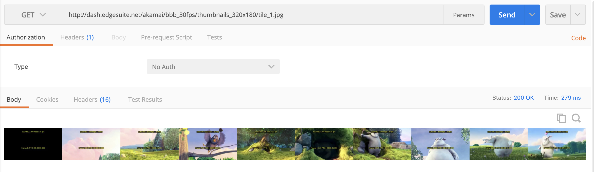

# In-Stream DASH thumbnails

DASH spec allows thumbnails to be specified in the stream itself as an additional image track next to audio, subtitles and video

Kaltura Player supports the loading of preview thumbnails (Single or Tiled) using In-Stream DASH thumbnailsautomatically once Klatura Player UI is being used.

The Katura Player will automatically populate the image-based track and it will be available in the list of the image tracks as well.

### Event - trackschanged

The application can register to a player event `trackschanged` this event payload will contain all the available tracks the player has identified in the manifest or given as external subtitles tracks.
This event is fired once the player has completed the intitalization process and `medialoaded` event was fired.

### Mainfest image track definition

[http://dash.edgesuite.net/akamai/bbb_30fps/bbb_with_tiled_thumbnails.mpd](http://dash.edgesuite.net/akamai/bbb_30fps/bbb_with_tiled_thumbnails.mpd)

```
<AdaptationSet id="3" mimeType="image/jpeg" contentType="image">
    <SegmentTemplate media="$RepresentationID$/tile_$Number$.jpg" duration="100" startNumber="1"/>
    <Representation bandwidth="12288" id="thumbnails_320x180" width="3200" height="180">
        <EssentialProperty schemeIdUri="http://dashif.org/thumbnail_tile" value="10x1"/>
    </Representation>
 </AdaptationSet>
```

In this example we have an image track that that mapped to 7 `jpg` files while last file is not fully populated with images:

```
DurationSec  = (10 * 60) + 34 = 634 sec

X = Ceil(DurationSec / 100) = Ceil(6.34) = 7
```



##### In the output image urls there are 10 images in each jpg file listed in one line which represent 1 image on seekbar each 10 seconds.

[http://dash.edgesuite.net/akamai/bbb_30fps/thumbnails_320x180/tile_1.jpg](http://dash.edgesuite.net/akamai/bbb_30fps/thumbnails_320x180/tile_1.jpg)
[http://dash.edgesuite.net/akamai/bbb_30fps/thumbnails_320x180/tile_2.jpg](http://dash.edgesuite.net/akamai/bbb_30fps/thumbnails_320x180/tile_2.jpg)
[http://dash.edgesuite.net/akamai/bbb_30fps/thumbnails_320x180/tile_3.jpg](http://dash.edgesuite.net/akamai/bbb_30fps/thumbnails_320x180/tile_3.jpg)
[http://dash.edgesuite.net/akamai/bbb_30fps/thumbnails_320x180/tile_4.jpg](http://dash.edgesuite.net/akamai/bbb_30fps/thumbnails_320x180/tile_4.jpg)
[http://dash.edgesuite.net/akamai/bbb_30fps/thumbnails_320x180/tile_5.jpg](http://dash.edgesuite.net/akamai/bbb_30fps/thumbnails_320x180/tile_5.jpg)
[http://dash.edgesuite.net/akamai/bbb_30fps/thumbnails_320x180/tile_6.jpg](http://dash.edgesuite.net/akamai/bbb_30fps/thumbnails_320x180/tile_6.jpg)
[http://dash.edgesuite.net/akamai/bbb_30fps/thumbnails_320x180/tile_7.jpg](http://dash.edgesuite.net/akamai/bbb_30fps/thumbnails_320x180/tile_7.jpg)

### The Player Tracks for this manifest:

Player image track will provide applications all available information that could be used inorder to manage the image track by its own

```js
{
  "tracks": [
     {
      "_id": "thumbnails_320x180",
      "_active": true,
      "_index": 0,
      "_available": true,
      "_url": "http://dash.edgesuite.net/akamai/bbb_30fps/thumbnails_320x180/tile_$Number$.jpg",
      "_width": 3200,
      "_height": 180,
      "_duration": 100,
      "_customData": {
        "bitrate": 12288,
        "startNumber": 1,
        "timescale": 1,
        "presentationTimeOffset": 0
      },
      "_rows": 10,
      "_cols": 1
    }
    {
      "_id": 0,
      "_active": false,
      "_label": "576p",
      "_index": 0,
      "_available": true,
      "_bandwidth": 3134488,
      "_width": 1024,
      "_height": 576
    },
    {
      "_id": 1,
      "_active": false,
      "_label": "720p",
      "_index": 1,
      "_available": true,
      "_bandwidth": 4952892,
      "_width": 1280,
      "_height": 720
    },
    {
      "_id": 2,
      "_active": false,
      "_label": "1080p",
      "_index": 2,
      "_available": true,
      "_bandwidth": 9914554,
      "_width": 1920,
      "_height": 1080
    },
    {
      "_id": 3,
      "_active": false,
      "_label": "180p",
      "_index": 3,
      "_available": true,
      "_bandwidth": 254320,
      "_width": 320,
      "_height": 180
    },
    {
      "_id": 4,
      "_active": false,
      "_label": "180p",
      "_index": 4,
      "_available": true,
      "_bandwidth": 507246,
      "_width": 320,
      "_height": 180
    },
    {
      "_id": 5,
      "_active": false,
      "_label": "270p",
      "_index": 5,
      "_available": true,
      "_bandwidth": 759798,
      "_width": 480,
      "_height": 270
    },
    {
      "_id": 6,
      "_active": false,
      "_label": "360p",
      "_index": 6,
      "_available": true,
      "_bandwidth": 1254758,
      "_width": 640,
      "_height": 360
    },
    {
      "_id": 7,
      "_active": true,
      "_label": "360p",
      "_index": 7,
      "_available": true,
      "_bandwidth": 1013310,
      "_width": 640,
      "_height": 360
    },
    {
      "_id": 8,
      "_active": false,
      "_label": "432p",
      "_index": 8,
      "_available": true,
      "_bandwidth": 1883700,
      "_width": 768,
      "_height": 432
    },
    {
      "_id": 9,
      "_active": false,
      "_label": "2160p",
      "_index": 9,
      "_available": true,
      "_bandwidth": 14931538,
      "_width": 3840,
      "_height": 2160
    },
    {
      "_id": "0_1_2_3_4_5_6_7_8_9",
      "_active": true,
      "_label": null,
      "_language": "und",
      "_index": 0,
      "_available": true
    }
  ]
}

```

#### Get Image Tracks API

```js
kalturaPlayer.getTracks('image');
```

```js
[
  {
    _id: 'thumbnails_320x180',
    _active: true,
    _index: 0,
    _available: true,
    _url: 'http://dash.edgesuite.net/akamai/bbb_30fps/thumbnails_320x180/tile_$Number$.jpg',
    _width: 3200,
    _height: 180,
    _duration: 100,
    _customData: {
      bitrate: 12288,
      startNumber: 1,
      timescale: 1,
      presentationTimeOffset: 0
    },
    _rows: 10,
    _cols: 1
  }
];
```

#### Get The Theumbnail Corresponding `ThumbnailInfo` Object by given player Positon Seconds

```js
kalturaPlayer.getThumbnail(110);
```

```js
{
  "_url": "http://dash.edgesuite.net/akamai/bbb_30fps/thumbnails_320x180/tile_2.jpg",
  "_width": 320,
  "_height": 180,
  "_x": 320,
  "_y": 0
}
```

#### Referance

[ThumbnailManager](https://github.com/kaltura/kaltura-player-js/blob/master/src/common/thumbnail-manager.js)

[ThumbnailInfo](https://github.com/kaltura/playkit-js/blob/master/src/thumbnail/thumbnail-info.js)

NOTE: The Player only supports pixel-based fragments, not percentage-based ones.
