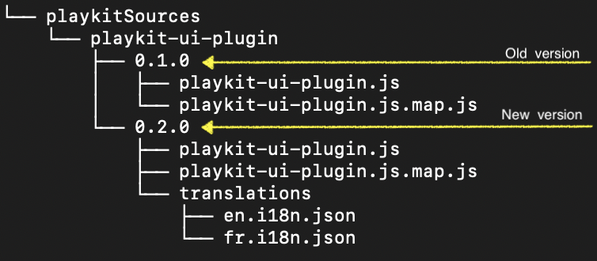

# Localization

This article explains how to upload translation dictionaries to Kaltura platform,
and how to control the language that actually will be served to the player.

> This feature uses the `ui.translations` config, for more details see [Adding translations and choosing locale language](https://github.com/kaltura/playkit-js-ui/blob/master/docs/translations.md)

## Uploading translation dictionaries via Kaltura platform

Plugin which served by Kaltura platform (via the bundle builder) can upload its translation dictionaries also by Kaltura platform.
To get this ability, The plugin needs to add the translation json file/s (`*.i18n.json`) under a `translation` folder in location of the plugin source code and source map.
For example: Plugin called _playkit-ui-plugin_, which contains, in the dist folder, 2 files - `playkit-ui-plugin.js` and `playkit-ui-plugin.js.map`,
Will add a `translation` folder with the translation file/s:

Each json file contains the translation dictionary under the language code key.
For example `en.i18n.json` looks like:

```json
{
  "en": {
    "buttons": {
      "btn1": "Button1",
      "btn2": "Button2"
    }
  }
}
```

And `fr.i18n.json` looks like:

```json
{
  "fr": {
    "buttons": {
      "btn1": "Bouton1",
      "btn2": "Bouton2"
    }
  }
}
```

Actually, the plugin could supply only one json contains multi translation dictionary. For example `langs.i18n.json` looks like:

```json
{
  "en": {
    "buttons": {
      "btn1": "Button1",
      "btn2": "Button2"
    }
  },
  "fr": {
    "buttons": {
      "btn1": "Bouton1",
      "btn2": "Bouton2"
    }
  }
}
```

## Control the served languages

By default only English dictionary injected to the player (by [`ui.translations`](https://github.com/kaltura/playkit-js-ui/blob/master/docs/configuration.md#configtranslations) config).
There are 2 ways to change this behavior:

1.  By the Studio.
2.  By a Url parameter called `langs` on the embed player Url. For example:
    _https://qa-apache-php7.dev.kaltura.com/p/1091/sp/109100/embedPlaykitJs/uiconf_id/15215933/partner_id/1091**/langs/de,fr**_.
