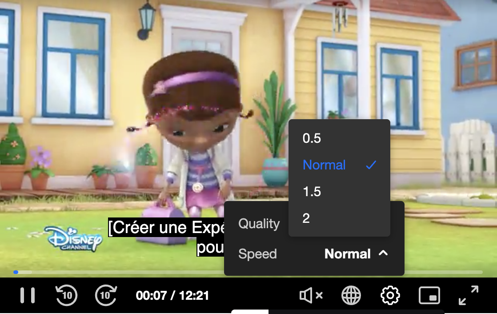
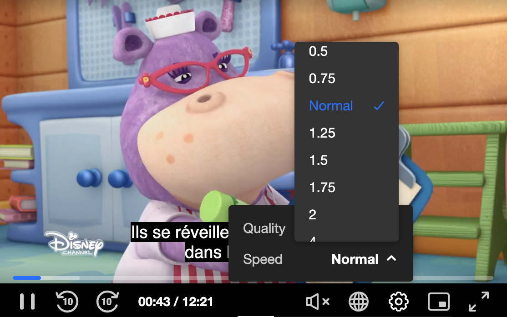

# Playback Speed Configuration

The Kaltura Player exposes configuration and APIs that are used for controling the playback speed.

The default playback speed is 1.

Values less than 1 will result in reducing playback speed relatively to the nornal speed

Values greater 1 will result in increasing playback speed relatively to the nornal speed


### Playback Speed UI control

The playback seepd can be changed using the UI setting => speed controller icon.




#### PlaybackRates

PlaybackRates sets the available rates at which the media can be played.

###### The player default playbackRates :

```
[
    0.5,
    1,
    1.5,
    2
]
```

Application may change the default config by providing new values in the playback config object

```
"playback": { 
...
       "playbackRates": [
          0.25,
          0.5,
          0.75,      
          1,
          1.25,
          1.5,
          1.75,
          2,
          4
      ],
....
```



Note:
 
  * Player may have issues to serve playack in high playback speed, especially on TV's
  * Negative values are not valid
  * Playback speed 0 will stop the playback


####Playback Speed API

Application may use the player API to get or set the player speed programatically.
make sure you set values which match the playbackRates Array values, as values which are out of that range will not impact the playback speed.

* Get API


```
kalturaPlayer.playbackRate = 1

1

```

* Set API

```
kalturaPlayer.playbackRate = 0.5

0.5

```

#### Event: RATE_CHANGE 

The application can listen to the `RATE_CHANGE` event and be informed that such action was triggered by the user 

```
const events = [
   kalturaPlayer.Event.Core.RATE_CHANGE
];

events.forEach(eventName => {
  kalturaPlayer.addEventListener(eventName, event => console.info('Event:',  event.type, " ", event.payload));
});
```


#### Example:

**[Playback Speed Example](https://codepen.io/giladna/pen/Poawvre)**

