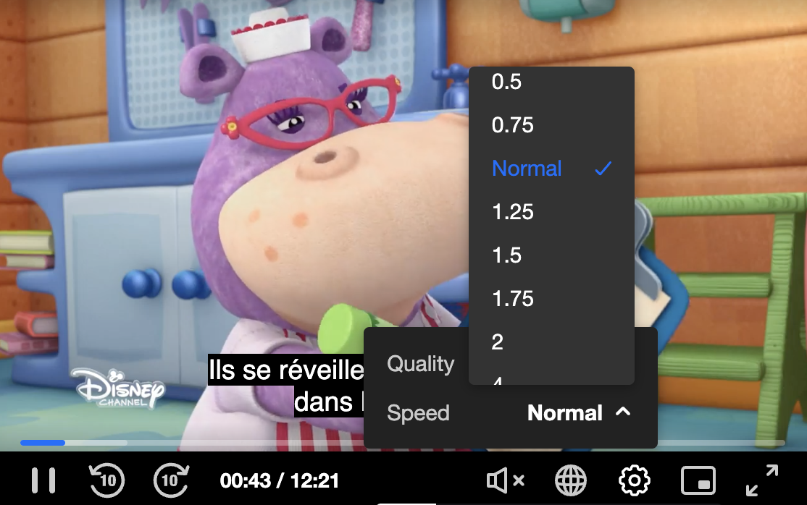

# Playback Speed Configuration

The Kaltura Player exposes configuration and APIs that are used for controling the playback speed.


### Playback Speed UI control

The playback seppd can be changed using the setting => speed icon.


#### PlaybackRates

PlaybackRates sets the available rates at which the media can be played back

######The player default playbackRates :

```
[
    0.5,
    1,
    1.5,
    2
]
```

Application may change the default config by giving new range to the plyer playback config object

```
"playback": { 
...
       "playbackRates": [
          0.25,
          0.5,
          0.75,      
          1,
          1.25,
          1.5,
          1.75,
          2,
          4
      ],
....
```



Note:
 
  * Player may have problem to serve playack in  high playback speed especially on TV's
  * Negative values are not valid.


####Playback Speed API

Application may use the player object to get ot update the player spped programatically.
make sure you give there values which match the playbackRates Array as ginving is values out of that range will not impact the UI.

* Get API


```
kalturaPlayer.playbackRate = 1

1

```

* Set

```
kalturaPlayer.playbackRate = 0.5

0.5

```

#### Event: RATE_CHANGE 

Application can listent to `RATE_CHANGE` event and be informed that such action was triggered by user 

```
const events = [
   kalturaPlayer.Event.Core.RATE_CHANGE
];

events.forEach(eventName => {
  kalturaPlayer.addEventListener(eventName, event => console.info('Event:',  event.type, " ", event.payload));
});
```


#### Example:

**[Playback Speed Example](https://codepen.io/giladna/pen/Poawvre)**

