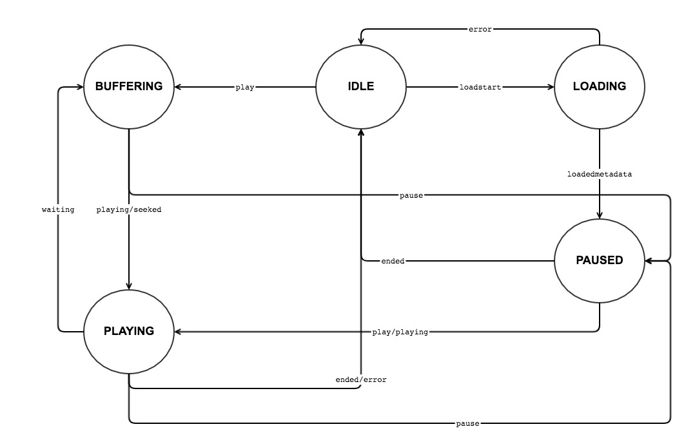

# Monitoring Player States

The player supports life cycle states (or statuses), which are based on HTML5 video events (e.g., `waiting`, `playing`, etc.). Whenever a state change occurs, the player will fire a related event in response.

## Table of Contents

- [Registering to State Changes](#registering-to-state-changed)
- [State API](#state-api)
- [Available State Types](#state-types)
- [Transitioning Between States](#transitions-between-states)

## Registering to State Changes

When a player changes its state, it fires a `PlayerStateChanged` event. The event data contains the player's old state as well as the new state. By registering to state changes and listening events, you can manage dependent logic accordingly (this applies mostly to UI changes).

The state's you register to listen to include the state class, the state type, and transitions between states. These next section provide additional details.

## State API

In the `PlayerStateChanged` event, the player exposes both its old state and its new state.
To learn more about what you can do with these states, refer to the detailed `State` class API ~~here~~.

## Available State Types

The player supports a number of player state types. You'll find a detailed list of player types [here](https://github.com/kaltura/playkit-js/blob/master/src/state/state-type.js).
<br>Here's an example how you can access a player state type:

```js
console.log(player.State.PLAYING); // 'playing'
```

## Transitioning Between States

When the player moves from one state to another, this is defined as a **transition**. For example, if the player's current state is `PLAYING` and the video element triggers a `pause` event, the player will change its state to `PAUSED`.

## Player State Machine

Here's a figure that illustrates the functionality of the player state machine:


## Example of State Changes

Here's an example of how a state change appears in the player code:

### Getting the New State

```js
player.addEventListener(player.Event.PLAYER_STATE_CHANGED, event => {
  const newState = event.payload.newState;
  console.log('New state type is: ' + newState.type);
});
```

### Getting the Previous State

```js
player.addEventListener(player.Event.PLAYER_STATE_CHANGED, event => {
  const oldState = event.payload.oldState;
  console.log('Previous state type is: ' + oldState.type);
  console.log('The player was in the previous state ' + oldState.duration + ' millis');
});
```

### Buffer Start

```js
player.addEventListener(player.Event.PLAYER_STATE_CHANGED, event => {
  const newState = event.payload.newState;
  if (newState.type === player.State.BUFFERING) {
    // Buffer start - show spinner
  }
});
```

### Buffer End

```js
player.addEventListener(player.Event.PLAYER_STATE_CHANGED, event => {
  const oldState = event.payload.oldState;
  if (oldState.type === player.State.BUFFERING) {
    // Buffer end - hide spinner
  }
});
```

### Buffer Underflow

```js
player.addEventListener(player.Event.PLAYER_STATE_CHANGED, event => {
  const State = player.State;
  const payload = event.payload;
  if (payload.oldState.type === State.PLAYING && payload.newState.type === State.BUFFERING) {
    // Buffer underflow
  }
});
```
