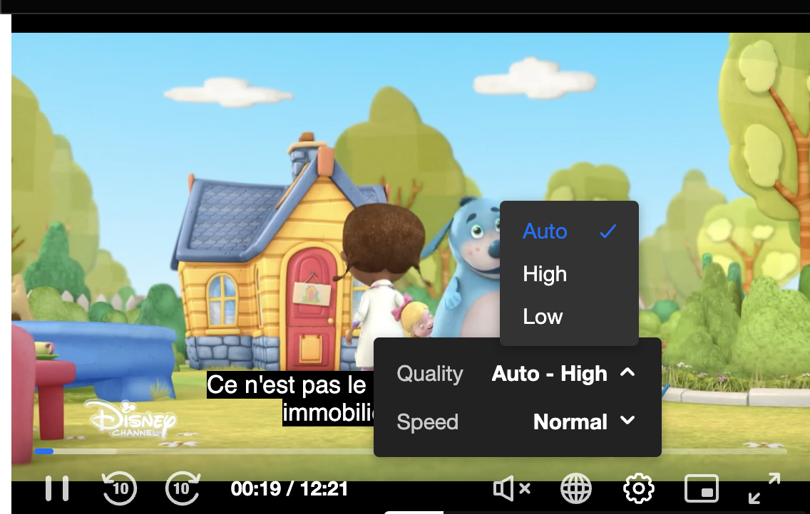
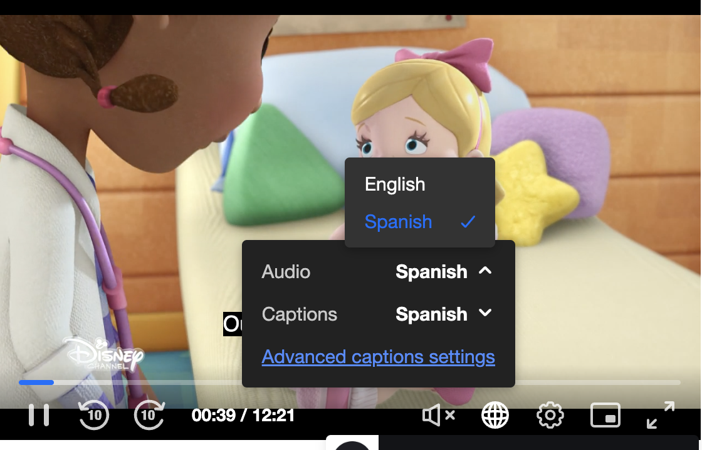

# Tracks Labels Configuration

The Kaltura Player exposes configuration and APIs that are used for controling the tracks and tracks labels.


Every track label can be cahanged using the player `customLabels` which configured on the player root level configuration object.

[Klatura Player config](https://github.com/kaltura/kaltura-player-js/blob/master/docs/configuration.md#configcustomlabels)
[Playkit config](https://github.com/kaltura/playkit-js/blob/master/docs/configuration.md#configcustomlabels)

```
 customLabels: {
    //qualities: translateVideoQuality,
    qualities: function (videoTrack) {
      if (videoTrack.height > 500) {
        return 'High';
      }
      return 'Low';
    },
    captions:  translateLangCode,
    audio: translateLangCode
  }
```


### Video Tracks Lables: translation function

Video Track has the following parameters which can be used for implementing the label logic


VideoTrack structure:

```
{
    "active": false,
    "label": "360p",
    "language": "",
    "index": 1,
    "available": true,
    "bandwidth": 719794,
    "width": 640,
    "height": 360
}
```

```
const translateVideoQuality = (track) => {
      if (track.height > 500) {
        return 'High';
      }
      return 'Low';
 };
``` 
  

### AudioText Tracks Labels: translation function

Audio/Text Tracks have the following parameters which can be used for implementing the labels logic


AudioTrack structure:

```
  {
    "id": 0,
    "active": false,
    "label": "English",
    "language": "en",
    "index": 0,
    "available": true
  }

```

TextTrack structure:

```
 {
    "id": 1,
    "active": true,
    "label": "Esp",
    "language": "es",
    "index": 1,
    "available": true,
    "kind": "subtitles",
    "default": false
  }
```

```
const translateLangCode = (track) => {
      if (track.language === "es" || track.language === "spa") {
        return 'Spanish';
      }
      else if (track.language === "en" || track.language === "eng") {
        return 'English';
      }
      return track.label;
};
```

### Tracks UI control

The tracks can be changed using the settings icon for video tracks and the globe icon for audio and text tracks







#### Example:

**[Tracks Lables configuration](https://codepen.io/giladna/pen/WNyexqO)**

### Tracks Documentation

**[Tracks Documentation](https://github.com/kaltura/kaltura-player-js/blob/master/docs/managing-tracks.md)**

