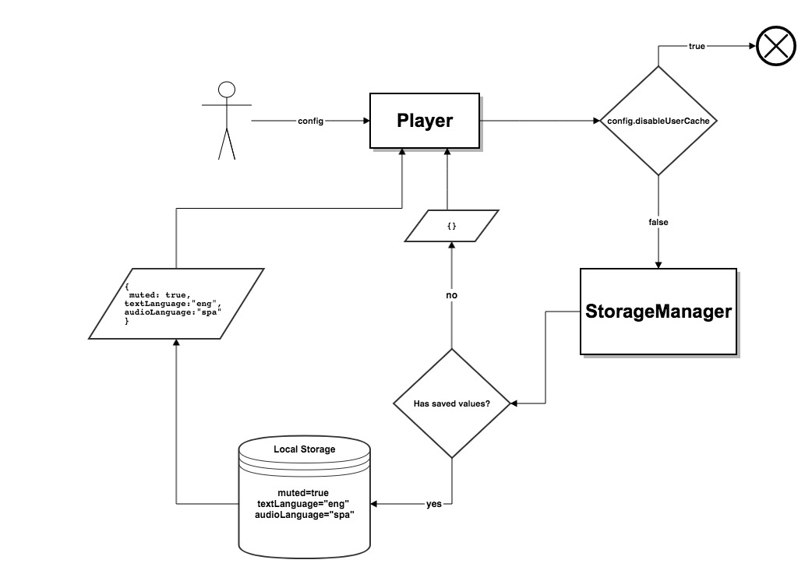
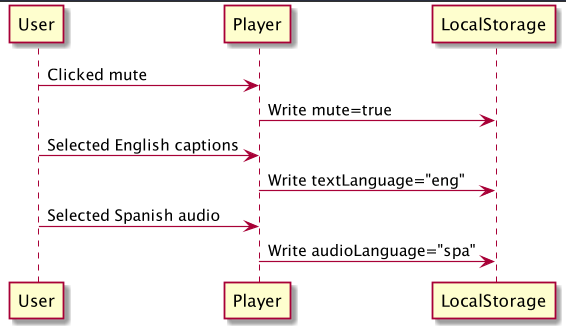
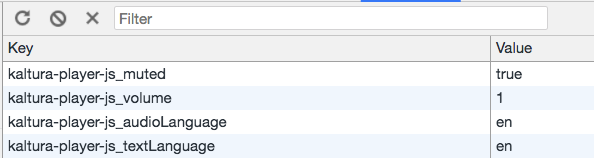

# User Preferences  

When the user configures the player according to his or her preference (e.g., starting up the player in mute), these user preferences (i.e., actions that are triggered by the user) create a *configurable value*,  which is saved in the browser's local storage. The player then uses those saved values to enable the user to retain the last choices they made when playing media.
<br>For example, if the last played media was muted, the next media will begin muted also, even if the user refreshed the page.

## Table of Contents
  * [Saved User Preference Values](#saved-user-preference-values)
  * [Workflow](#workflow)
  * [View and Edit Values](#view-and-edit-values)
  * [Disable User Preference](#disable-user-preference)
  * [Browser Compatibility](#browser-compatibility)
  
## Saved User Preference Values

The following values are saved under user preferences:
* Muted
* Volume
* Audio language track
* Text language track (i.e., captions)
* Captions text style (this is the style of the text used in the captions)

## Workflow  

When a player instantiates, a partial configuration is created internally by the `StorageManager` and supplied to the player using the saved values found in the local storage.

<br>The structure of this initial configuration is as follows:
```js
{
	muted: string,
	volume: number,
	audioLanguage: string,
	textLanguage: string,
	textStyle: TextStyle
}
```

The following flow-chart diagram shows a high-level workflow of this scenario:


After the player starts to to play, the `StorageManager` will track any user interaction with the UI and update the storage value accordingly, as you can see in the following sequence diagram:
<br><br>



## View and Edit Values  
Let's look at an example based on a Chrome browser (this can be done on any supported browser; see next section).

1. Open your test page.
2. Right click and select **Inspect**.
3. Go to the _Application_ tab.
4. In the left menu, choose _Local Storage_ and click the arrow button.
5. Choose your test page domain.

You'll be able to see your saved player values in the local storage:
<br><br>


* To clear the values, click the **Clear** button:

* To edit the values, click any value in the right column and edit it.

## Disable User Preference 

The user preference configuration is enabled by default. To disable it, you'll need to configure the [`disableUserCache`](./configuration.md#configdisableusercache) value as *True* when creating the player instance.

```js
{
  ...
  disableUserCache: true // Disable user preferences
  ...
}
```

## Browser Compatibility  

The user preference feature works on all browsers that support the localStorage option.
<br>For a complete list of browsers that support localStorage, see [here](https://developer.mozilla.org/en-US/docs/Web/API/Window/localStorage).

